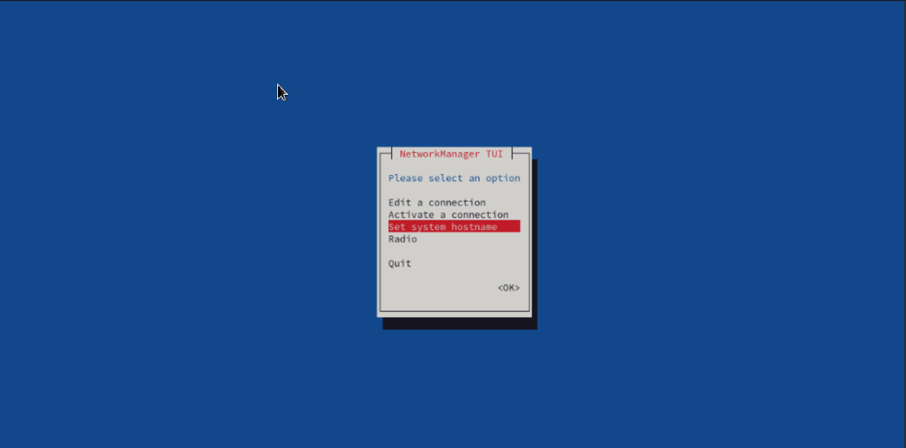
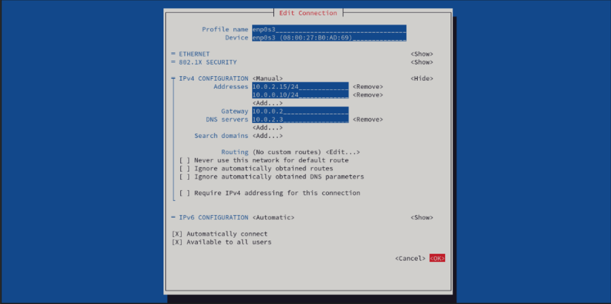
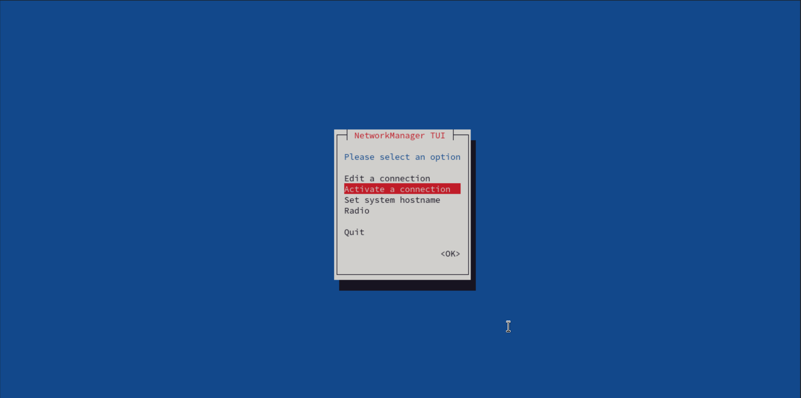
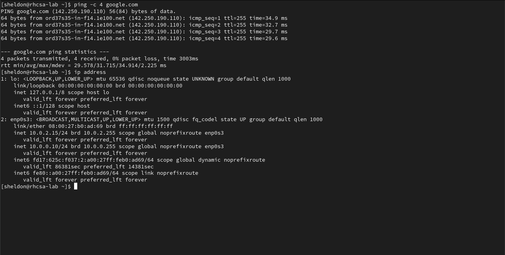
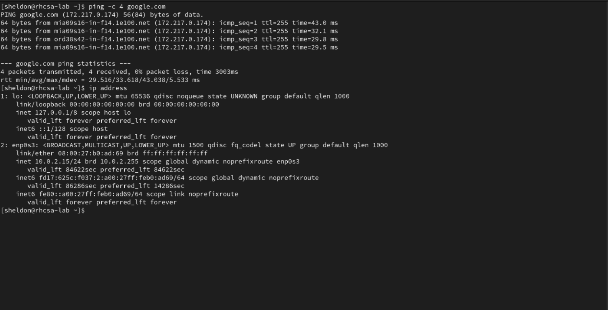

 This was a fun one! Let's do it together.


---
## RHCSA Networking Lab Objectives
1) Set hostname for your server to `rhscsa.example.com`
2) Set your server to a fixed IP address that matches your current network configuration
3) Set a second IP address `10.0.0.10/24`
4) Enable host name resolution for your local server hostname
5) Reboot and verify network is still working with new settings

---

### Preliminary Information Gathering

Before we begin, let's first gather some information.

>⚠ Note: The addresses and subnets used in this procedure may not match the ones on your system. Use what is on your system.

With respect to the initial network settings, you'll want to create a backup in case anything goes wrong.

We can easily do that by redirecting standard output to some backup files.

```bash
mkdir netbackup
```

```bash 
ip address > ~/netbackup/ipaddr.bak 
```

```bash
ip route > ~/netbackup/iproute.bak
```


```bash
cat /etc/resolv.conf > ~/netbackup/resolv.bak
```

Now that we've got that out of the way, let's get to work! 👷🏻‍♂️


## 1. Set hostname for your server to rhscsa.example.com

If you want to do this via the command line run 

```bash 
hostnamectl hostname rhcsa.example.com 
```

However, you can <u>**and probably should**</u> perform this task via `nmtui`


## 2. Set your server to a fixed IP address that matches your current network configuration


**First**, we will run 

```bash
ip address
``` 

📝 Note the first address and subnet mask on the line beginning with **inet**

`inet 10.0.2.15/24` 

<br/>

**Next**, we will run `ip route` in order to grab our default gateway. 
```bash
ip route
``` 

It should say something like `default via 10.0.2.2`

<br/>

**Finally**, we will grab our current DNS address by running 

```bash 
cat /etc/resolv.conf
```

You should see a line like `nameserver 10.0.2.3` 

Be sure to note this address somewhere because we will use it in a moment. 

<br/>


**nmtui**

Using `nmtui` is where the real fun begins because it makes managing your network settings an absolute breeze.

```bash 
nmtui
```

`nmtui` stands for **Network Manager Text User Interface**. It is a command-line utility in Linux used to manage network connections through a text-based interface.

We'll start by selecting **Edit a connection**.


Select the relevant interface and then **Edit**.


Arrow down to where it says `IPv4 CONFIGURATION <Automatic>` and hit enter to switch it to **Manual**.



Go down to the first address and hit `enter` to edit. Input the address that we grabbed from the `ip address` command earlier.

 `10.0.2.15/24`

## 3. Set a second IP address `10.0.0.10/24`

Per the objectives, add a second for `10.0.0.10/24` just below the first one.

**Next**, go down to the gateway line and add the default gateway address we grabbed earlier from the `ip route` command. 

`10.0.0.2`

On the DNS servers line, add the address we grabbed from `/etc/resolv.conf`

`10.0.2.3`

**Finally**, select OK to return to the main menu.


Select **Activate a connection** from the menu. 



Toggle the interface off and then back on by hitting `enter` a few times. It should cycle through **Deactivate > Activate > Deactivate**


**Finally**, we can return to the main menu and exit `nmtui`


## 4. Enable host name resolution for your local server hostname

Using **vim**

```bash
sudo vim /etc/hosts
``` 

or if you prefer **nano**

```bash
sudo nano /etc/hosts
```

add a line containing the following  

`10.0.2.15 rhscsa.example.com` to the end of the file. **Save and quit**

## 5. Reboot and verify network is still working with new settings

Now we should `reboot` to test the persistence of the new settings ...

```bash
reboot
```

After the system reboots and we will want to run the commands below to test connectivity, DNS resolution, and configuration.
```bash
ping -c 4 google.com
``` 
```bash 
ip address
```
If we were successful, we should see something like this.




Once you have completed all of the objectives, you'll want to return your settings to their original configuration. 

To do that, just go back into `nmtui` and remove the manual entries we added previously. Then switch back to automatic ipv4 configuration, toggle the connection, and `reboot` one last time.

```bash 
reboot
``` 

**Lastly**, run `ping` and `ip address` to verify the settings are back to normal. 



**You really did it. Job well done!** 🥳

I hope you had fun, I know I did! 