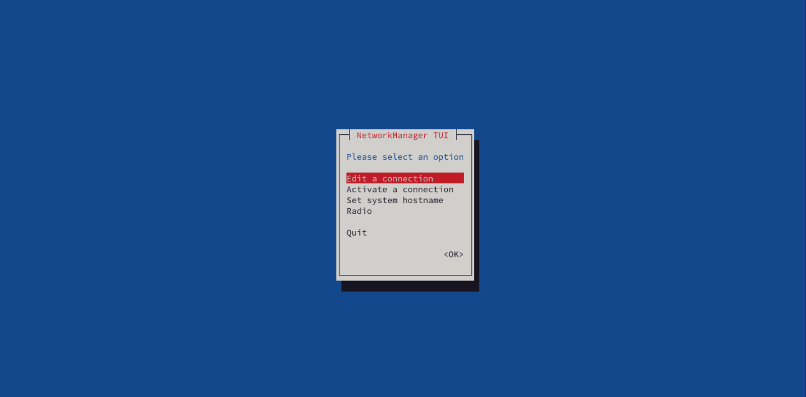
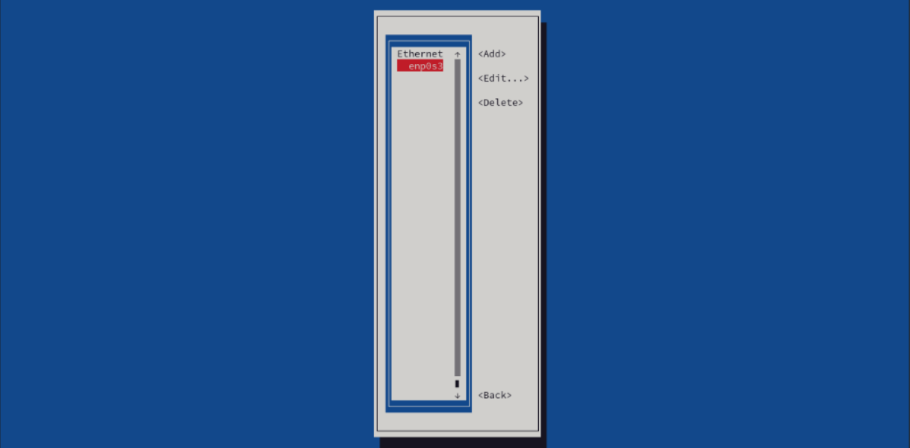

 This was a fun one! Let's do it together. 👍🏻

---
## 🟥 RHCSA Networking Lab Objectives
1) Set hostname for your server to `rhscsa.example.com`
2) Set your server to a fixed IP address that matches your current network configuration
3) Set a second IP address `10.0.0.10/24`
4) Enable host name resolution for your local server hostname
5) Reboot and verify network is still working with new settings

---

### Preliminary Information Gathering
First, we will need to do some preliminary information gathering. 

>⚠ Note: Addresses used in this lesson may not match the ones on your system. Use what is on your system.

With respect to the initial network settings, you'll probably want to do something like this (redirecting command output to a file) to maintain a copy of your current settings in case anything goes wrong.

`ip address > ~/netbackup/ipaddr`

`ip route > ~/netbackup/iproute`

`cat /etc/resolv.conf > ~/netbackup/resolv`

Now that we've got that out of the way, let's get to work!

## 1. Set hostname for your server to rhscsa.example.com

If you want to do this via the command line run 

`hostnamectl hostname rhcsa.example.com `

**However**, you can (and probably should) do this using the `nmtui` command

## 2. Set your server to a fixed IP address that matches your current network configuration

**First** run `ip address` and note the first address and subnet mask on the line beginning with 'inet'

In my case it is `inet 10.0.2.15/24` 

**Next**, we run `ip route` to grab our default gateway. It should say something like 
`default via 10.0.2.2`

**Finally**, we will grab our current DNS address by running 

`cat /etc/resolv.conf`

You should see a line like `nameserver 10.0.2.3`, jot down this address because we will use it in a moment. 

**nmtui**

Using `nmtui` is where the real fun begins because it makes managing your network settings a breeze!

**nmtui** stands for Network Manager Text User Interface. It is a command-line utility in Linux used to manage network connections through a text-based interface.

We'll start by selecting 'Edit a connection'

Select the relevant interface and then Edit.

Arrow down to where it says `IPv4 CONFIGURATION <Automatic>` and hit enter to switch it to Manual.

Go down to address line 1 and hit enter the address we grabbed from the `ip address` command earlier `10.0.2.15/24`

## 3. Set a second IP address `10.0.0.10/24`

Per the instructions add a second for `10.0.0.10/24` just below the first one.

**Next**, go down to the gateway line and add the default gateway address we grabbed earlier from the `ip route` command. 

`10.0.0.2`

On the DNS servers line add the address we grabbed from `/etc/resolv.conf`

`10.0.2.3`

**Finally**, go down to OK and go back to the main menu

Select 'Activate a connection' 

Toggle the interface by hitting enter a few times. It should cycle through **Deactivate > Activate > Deactivate**

**Finally**, we can return to the main menu and exit `nmtui`

## 4. Enable host name resolution for your local server hostname

Using 

`sudo vim /etc/hosts` 

or if you prefer 

`sudo nano /etc/hosts`

add a line containing the following  

`10.0.2.15 rhscsa.example.com` to the end of your `/etc/hosts` file 

**Save and quit**

## 5. Reboot and verify network is still working with new settings

Now we `reboot` to test the persistence of the new settings ...

After the system reboots and we run `ping -c 4 google.com` and `ip address` we should see something like this

You'll probably want to return your setting to where they were originally. 

To do that just go back into `nmtui` and remove the manual entries we added previously. Then you'll also want to switch back to automatic ipv4 configuration, toggle the connection again and then `reboot` 

**Lastly**, run `ping` and `ip address` to verify your settings are back to normal. 

**You really did it. Job well done!**  🥳 I hope you had fun, I know I did! 